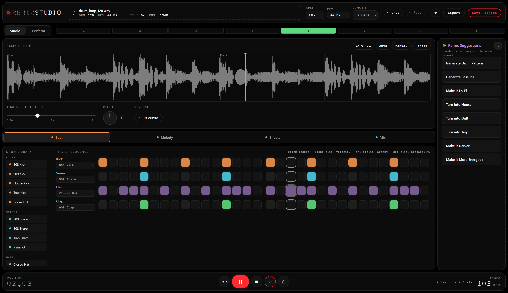
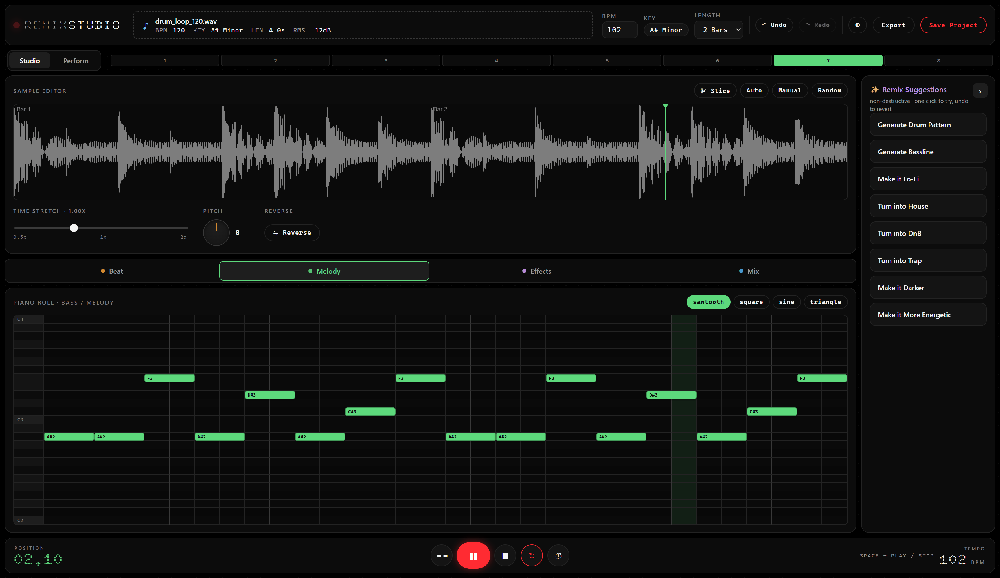
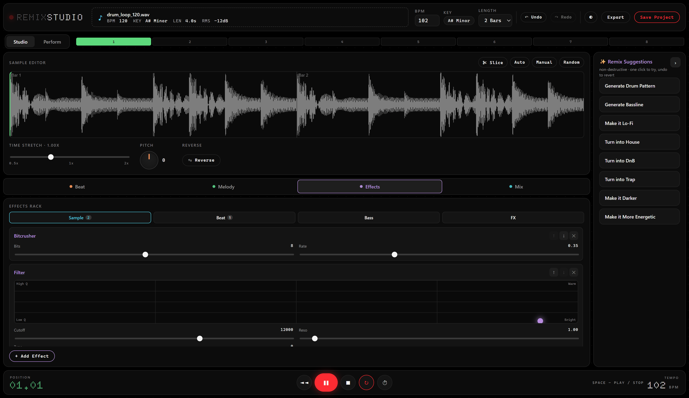
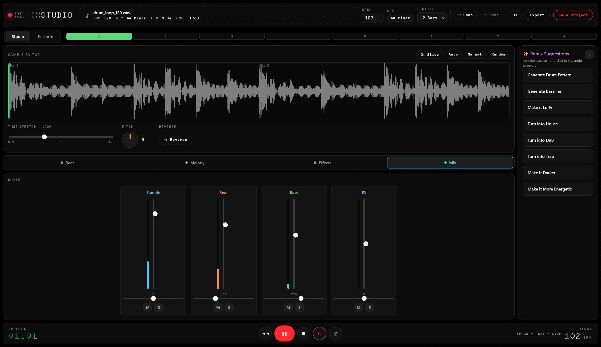
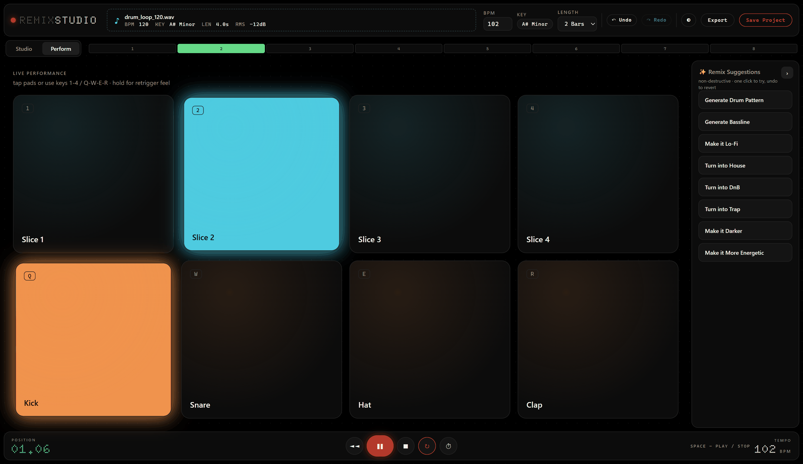
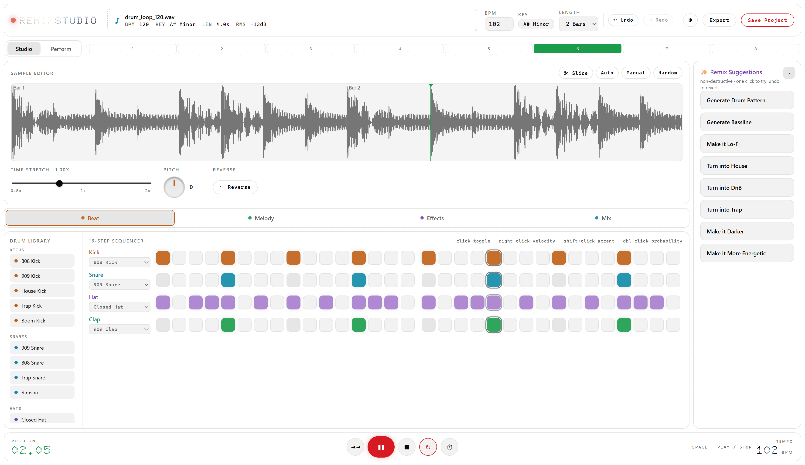
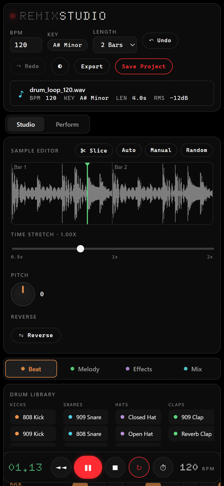

<p align="center">
  
</p>

<h1 align="center">Remix Studio</h1>

<p align="center">
  A browser-based sampler / beat machine that sits between a DJ sampler and a drum machine.<br>
  Drop in one audio sample, reshape it, layer synthesized drums and a bassline, run it through effects, and hear the result live.
</p>

<p align="center">
  
  
  
  
  
</p>

<p align="center">
  
</p>

Everything is driven by the Web Audio API — no page reloads, no server, no
audio libraries. The drum kit and synth are generated with oscillators and
noise, so the app ships with a full instrument set and no binary sample files.

## Run

```bash
yarn
yarn dev
```

Then open the printed local URL, and drag an audio file onto the top bar (or
click **Upload sample**) to begin. Press <kbd>Space</kbd> to play.

Other scripts: `yarn build` (type-check + production bundle into `dist/`),
`yarn build:dev`, `yarn preview`.

## Tour

<table>
  <tr>
    <td width="50%">
      
      <p align="center"><b>Melody</b> — click-to-place notes on a two-octave piano roll, played by a subtractive synth.</p>
    </td>
    <td width="50%">
      
      <p align="center"><b>Effects</b> — a per-channel insert chain you can add to, reorder and tweak while it plays.</p>
    </td>
  </tr>
  <tr>
    <td width="50%">
      
      <p align="center"><b>Mix</b> — Sample / Beat / Bass / FX strips with volume, pan, mute, solo and live peak meters.</p>
    </td>
    <td width="50%">
      
      <p align="center"><b>Perform</b> — eight large pads (slices + drums) with keyboard triggers for live play.</p>
    </td>
  </tr>
</table>

<table>
  <tr>
    <td width="70%">
      
      <p align="center"><b>Light theme</b> — toggled from the toolbar and remembered between sessions.</p>
    </td>
    <td width="30%">
      
      <p align="center"><b>Mobile</b> — the workspace stacks into a single column on phones.</p>
    </td>
  </tr>
</table>

## Features

- **Upload & analysis** — decode any audio file, then estimate BPM
  (onset-envelope autocorrelation), musical key (chroma + Krumhansl profiles),
  transients (spectral-flux onsets), duration and loudness.
- **Sample editor** — canvas waveform with bar markers and a live playhead,
  pitch (rotary knob, ±12 semitones), time-stretch (0.5–2×), reverse, and
  slice modes (Auto / Manual-even / Random-glitch). Slices are re-sequenced
  across the loop so the sample plays in time.
- **16-step sequencer** — Kick / Snare / Hat / Clap lanes with per-step
  velocity (right-click), probability (double-click) and accent (shift-click).
  A drum library of 808/909/House/Trap/etc. voices you can audition and assign.
- **Piano roll** — click to place bass/melody notes over a two-octave grid,
  played by a subtractive synth (saw/square/sine/triangle).
- **Effects rack** — per-channel insert chain you can add to, remove and
  reorder live: EQ, Filter (with XY pad), Reverb, Delay, Distortion, Chorus,
  Compressor, Bit Crusher, Phaser, Flanger.
- **Mixer** — Sample / Beat / Bass / FX strips with volume, pan, mute, solo and
  animated peak meters.
- **Transport** — play/stop, loop, metronome, BPM, bar-length.
- **Smart Remix panel** — one-click algorithmic transforms (generate pattern,
  generate bassline, lo-fi, house, DnB, trap, darker, more energetic). Each is
  non-destructive and undoable.
- **Performance mode** — 8 large pads (slices + drums) with keyboard triggers.
- **Export** — render the loop to WAV via an `OfflineAudioContext`; save the
  arrangement as a `.remix.json` project file.
- **Undo / redo** across edits, **light / dark theme**, and an installable PWA.

### Keyboard

| Key | Action |
| --- | --- |
| <kbd>Space</kbd> | Play / stop |
| <kbd>1</kbd> <kbd>2</kbd> <kbd>3</kbd> <kbd>4</kbd> | Trigger slice pads 1–4 |
| <kbd>Q</kbd> <kbd>W</kbd> <kbd>E</kbd> <kbd>R</kbd> | Trigger drum pads (Kick / Snare / Hat / Clap) |
| <kbd>A</kbd> <kbd>S</kbd> <kbd>D</kbd> <kbd>F</kbd> | Audition the four drum lanes |
| Scroll over the waveform | Zoom |

## Architecture

Timing-critical audio lives in framework-agnostic modules under `src/audio/`:

| Module | Role |
| --- | --- |
| `engine.ts` | `AudioContext`, master bus + limiter, look-ahead step scheduler |
| `channel.ts` | Mixer channel: input → inserts → pan → gain → analyser → bus |
| `drums.ts` | Oscillator/noise drum voices and the preset library |
| `synth.ts` | Subtractive synth voice for the bass / melody lane |
| `effects.ts` | Insert effects, each a small graph with typed parameters |
| `sample.ts` | Sample player, slicing helpers, pitch / stretch / reverse |
| `analysis.ts` | BPM, key, transient and loudness estimation |
| `wav.ts` | WAV encoding + download for the offline-rendered export |

A single reactive store (`src/store.ts`) bridges UI state to the engine; the
engine's look-ahead scheduler reads the store on each 16th-note step. Vue
components in `src/components/` are thin views over that store, and
`src/remix.ts` holds the rule-based Smart Remix transforms.

## Honest limitations

- BPM / key detection are lightweight estimates, not production-grade MIR.
- Time-stretch uses playback-rate (so pitch tracks speed) rather than a phase
  vocoder — solid and glitch-free, but not formant-preserving.
- The Smart Remix panel is rule-based, not a trained model.
- MP3 export isn't wired up yet (WAV + project JSON are). The Export button
  produces a WAV.
- Projects can be saved as `.remix.json`, but loading one back isn't
  implemented yet.

## License

Copyright © 2026 Henry Triplette. All rights reserved.
